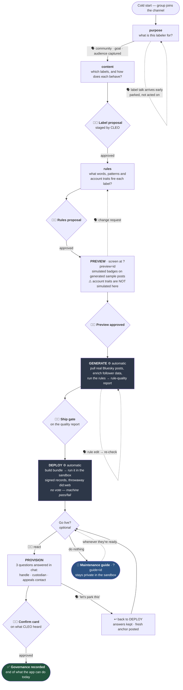

# CLEO flow — stages and decision points

One-page recap for the start of a pilot session. Companion to `technical-pilot-run-sheet.md`.

---

## Where the group actually decides

Six moments. Five are 👍🏾 reactions on a specific message; one is just talking.

| # | Decision | How | What it moves |
|---|---|---|---|
| 1 | Approve the labels | 👍🏾 on the proposal card | `purpose`/`content` → `rules` |
| 2 | Approve the rules | 👍🏾 on the rules card | `rules` → `complete`, opens **preview** |
| 3 | Approve the preview | 👍🏾 on the preview prompt | `preview` → `generate` |
| 4 | Ship gate | 👍🏾 on the quality report prompt | `generate` → `deploy` |
| 5 | Go live — **or not** | 👍🏾 to start · ignore it for the guide | `deploy` → `provision` |
| 6 | Confirm governance answers | 👍🏾 on the confirm card | commits the record |

**Threshold:** majority engages above 2 members. So **3 members → 2 approvals**; 4 → 3; 1–2 → any
single reaction passes. Extra reactions after the threshold are no-ops.

**Not a decision point:** the sandbox run. It's a machine pass/fail and flows straight through to the
report with no vote.

**Talking, not reacting:** the three provisioning answers, any change request during preview, a rule
edit during generate, and standing down from provisioning. CLEO listens for these in chat.

---

## What happens on its own

| Stage | CLEO does | Group sees |
|---|---|---|
| `generate` | pulls real posts, enriches follower data, runs the rules | corpus count + per-label quality report with examples |
| `deploy` | builds the bundle, runs it under a sandbox identity | bundle summary, then the run report: identity, posts, signed records, per-label counts |
| `provision` | derives handle candidates from the labeler's name | the three questions, with candidates offered |

---

## Two things to say out loud at the start

**Nothing goes public.** No Bluesky account is created, no handle is claimed, nothing is published —
at any stage, including provisioning. The sandbox identity is a throwaway `did:web` that isn't
served.

**Provisioning is where it stops.** Recording the three answers is the last thing the app can do.
Creating a real account needs email addresses this version doesn't collect and a step that isn't
built, and CLEO says so plainly at the end.
